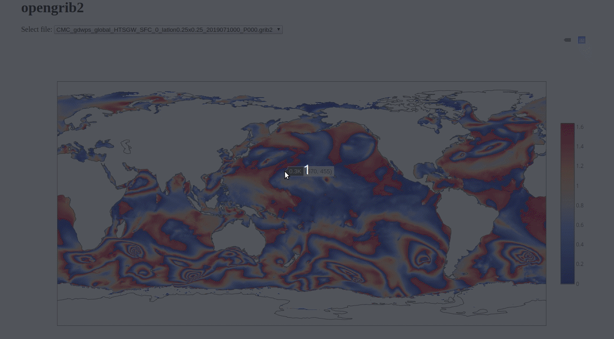

# METEOHACK

Team [meteo.io](https://www.hackworks.com/fr/meteohack/teams/meteoio)'s `opengrib2` project for the 2019 [METEOHACK](https://www.hackworks.com/fr/meteohack) hackathon.

Video preview: https://www.youtube.com/watch?v=K1vVnTqb87Q

## What is this thing?

Most of the work here is under `./grib2class.js` which is a grib2 reader written
in pure JavaScript (i.e. that runs in the browser!)

To decode the MSC grib2 files (which use JPEG2000 for compression) we must include a third-party module called `jpx.js`.
The JavaScript file is located in `./jpeg2000/jpx.min.js`, downloaded from [@OHIF/image-JPEG2000](https://github.com/OHIF/image-JPEG2000).

This repo offers two demos:

- one "all client-side" demo, where MSC grib2 data is fetched, decoded and
  plotted all in the client. This demo requires a proxy server, as the MSC's
  Datamart does not (yet) have [CORS](https://developer.mozilla.org/en-US/docs/Web/HTTP/CORS) setup.

- one "local" demo, where MSC grib2 files are downloaded and served up locally.
  We decode and plot the grib2 data in the client. This demo is also available
  online at: https://archmoj.github.io/opengrib2/

We also built a script that scrapes the [Datamart indices](https://dd.weather.gc.ca/), building a list of URLs to grib2 files.
For more info, look under `./scraper/README.md`.

##### Prequisites

Node.js, npm and a "modern" browser.

##### Known limitation

- We don't draw a basemap (i.e the coastline overlay) on top of "regional" grib2 data
- We only draw one ensemble member, even though we decode them all
- Can't be exported as PNG, nor uploaded to plot.ly (like other plotly.js graphs)

## How to run the "local" demo

- run `npm i`
- run `npm run build:bundle-local-data`
- run `npm start`

## How to push the "local" demo to GitHub pages

- run `npm run build:bundle-local-data`
- git add `build/bundle.js`
- commit and push to `origin/master`, or make a PR ;)
- view it at: https://archmoj.github.io/opengrib2/

## How to run the "all client-side" demo

- run `npm i`
- run `npm run build:bundle-proxy-data`
- run `npm run proxy` in one terminal tab
- run `npm start` in another terminal tab

## How to dev this thing

- run `npm i`

for "local" demo:
  - run `NODE_ENV='local-data' npm run dev` in one terminal tab
  - run `npm start` in another terminal tab

for "all-client-side" demo:
  - run `NODE_ENV='proxy-data' npm run dev` in one terminal tab
  - run `npm run proxy` in a 2nd terminal tab
  - run `npm start` in a 3rd terminal tab

## How to make list of JavaScript dependencies licenses

- run `npm run build:license_list`

----------

Shoutouts to [Plotly](https://plot.ly/) for letting us take part of this
hackathon :tada:

